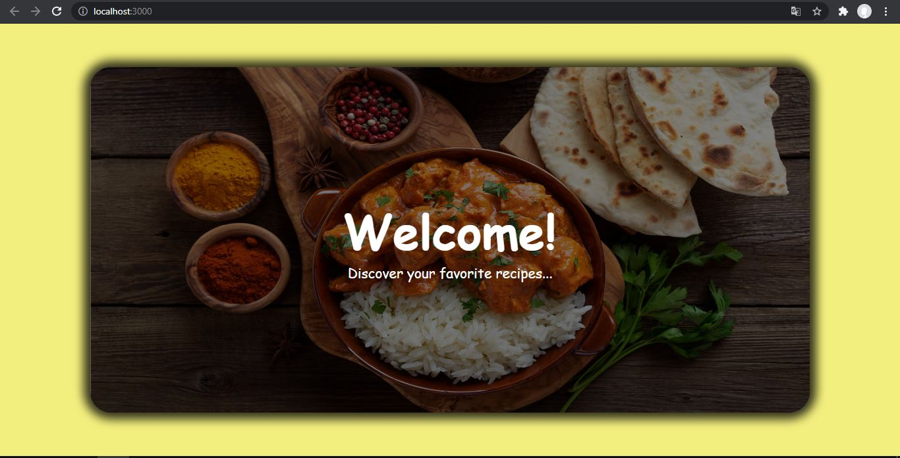
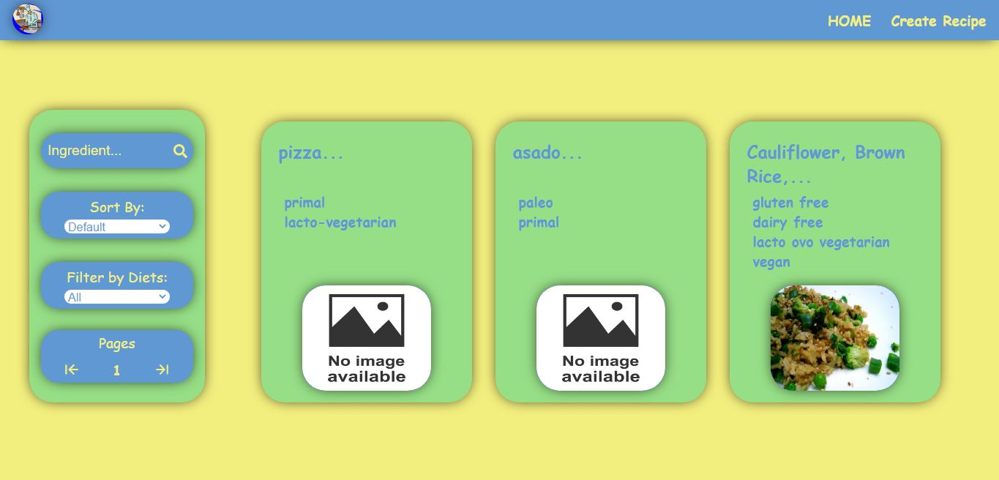
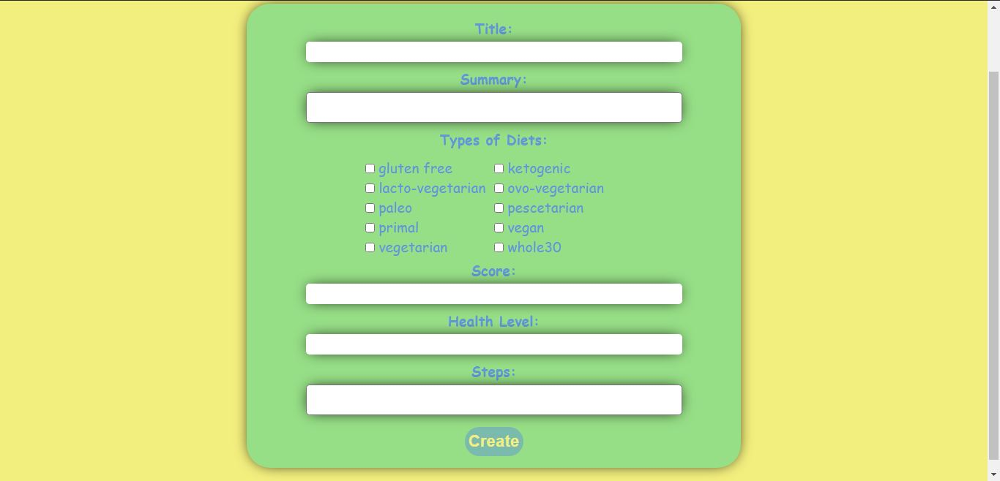
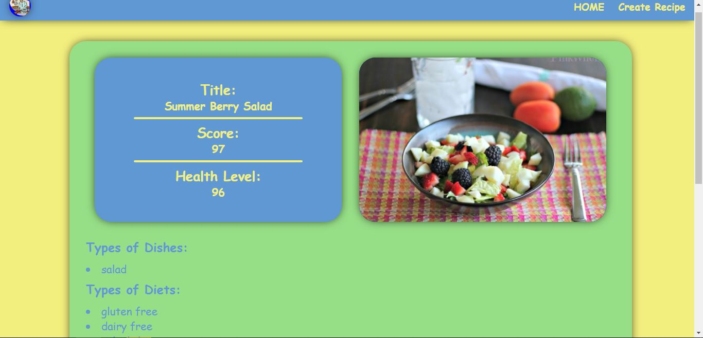
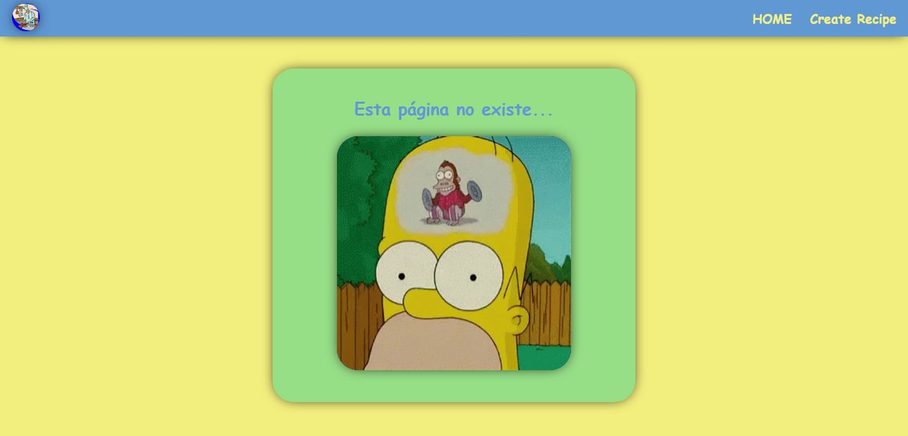

<h2 align="center"> Hola, soy Fede! 👋 </h2>

```js
const Fede = {
  skills: {
      frontEnd: [
          {basics: ['HTML', 'CSS', 'SASS']},
          {javaScript: ['React', 'React-Native', 'Redux']},
        ],
      backEnd: [
          {javaScript: ['NodeJs', 'Express', 'Sequelize', 'PostgreSQL']},
        ],
    },
  proyects: [
      {foodSPA: ['React', 'Redux', 'NodeJs', 'Express', 'Sequelize', 'PostgreSQL']},
    ],
}
```
<div>
  <h3> Lenguajes y Herramientas :computer: : </h3>
  <ul>
    <li> HTML </li>
    <li> CSS </li>
    <li> React </li>
    <li> Redux </li>
    <li> JavaScript </li>
    <li> Node JS </li>
    <li> Express </li>
    <li> PostgreSQL </li>
    <li> Sequelize </li>
    <li> Git </li>
  </ul>
</div>

<div>
  <h3> 📍 Proyectos: </h3>
  <div>
    <h4> Food SPA </h4>
    <span>  </span>
    <span>  </span>
    <span>  </span>
    <span>  </span>
    <span>  </span>
  </div>
  <h4> Más próximamente... 😎 </h4>
</div>

<div>
  <h3> Contactame aquí! 😀 </h3>
  <a href="https://www.linkedin.com/in/federico-garcia-full-stack-developer/" 
     target="_blank"
     title="LinkedIn"
     > 
      
  </a>
  <a href="mailto:garcia.fed3rico@gmail.com" 
     target="_blank"
     title="Gmail"  
     > 
     
  </a>
</div>