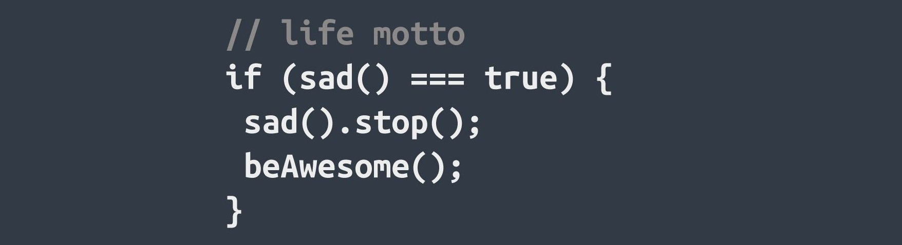

<!--  -->
<!--  -->


<h1 align="center"> Hola, soy Fede! 👋 </h1>

```js
const Fede = {
  skills: {
      frontEnd: [
          {basics: ['HTML', 'CSS', 'SASS']},
          {javaScript: ['React', 'React-Native', 'Redux']},
        ],
      backEnd: [
          {javaScript: ['NodeJs', 'Express', 'Sequelize', 'PostgreSQL']},
        ],
    },
  proyects: [
      {foodSPA: ['React', 'Redux', 'NodeJs', 'Express', 'Sequelize', 'PostgreSQL']},
    ],
}
```
